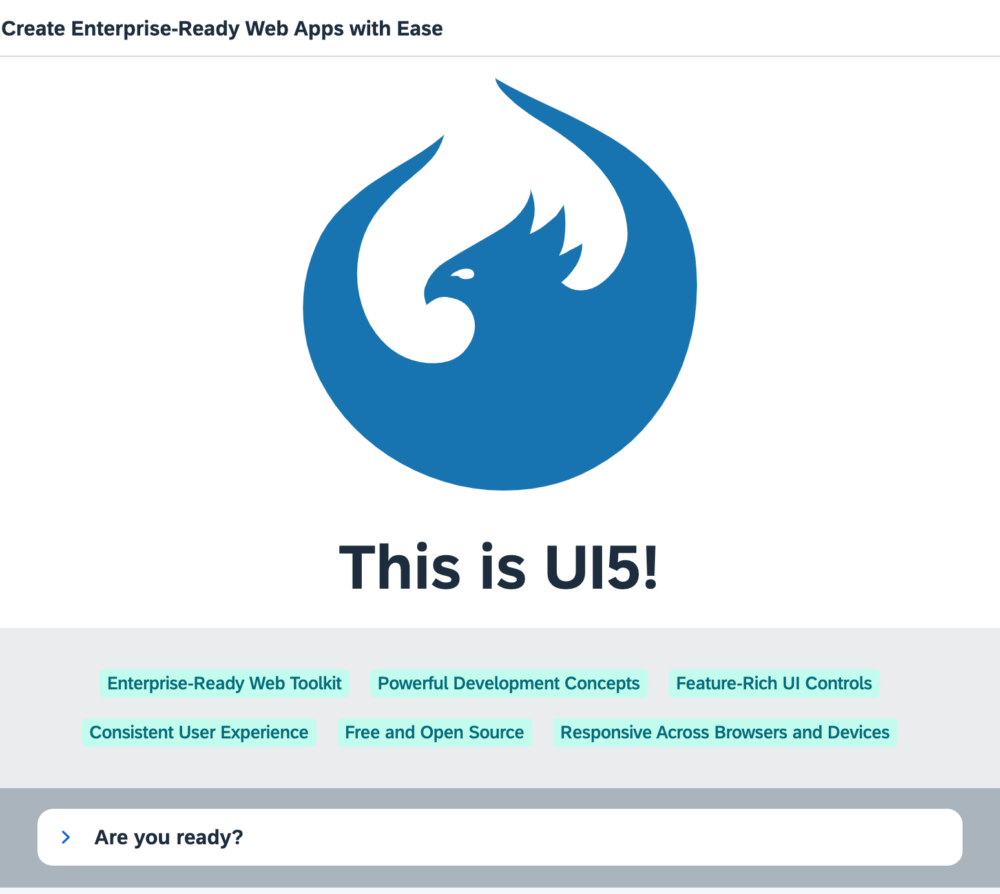

# OpenUI5 Quickstart

In this tutorial we'll introduce you to all major development paradigms of OpenUI5. 

This section is relevant for TypeScript only
We'll also demonstrate the use of TypeScript with OpenUI5 and highlight the specific characteristics of this approach.

## Description

We first introduce you to the basic development paradigms like *Model-View-Controller* and establish a best-practice structure of our application. We'll do this along the classic example of “Hello World” and start a new app from scratch. Next, we'll introduce the fundamental data binding concepts of OpenUI5 and extend our app to show a list of invoices. We'll continue to add more functionality by adding navigation, extending controls, and making our app responsive. We'll also have look at the testing features and the built-in support tools of OpenUI5.

### Preview

.

> 💡 **Tip:**  
> You don't have to do all tutorial steps sequentially, you can also jump directly to any step you want. Just download the code from the previous step and make sure that the application runs as intended.
> 
> You can view the samples for all steps here in this repository.
>

### Steps

The tutorial consists of the following steps. To start, just open the first link - you`ll be guided from there.

- **[Step 1: Ready...](steps/01/README.md "Let's get you ready for your journey! We bootstrap OpenUI5 in an HTML page and implement a simple &quot;Hello World&quot; example.")** ([🔗 Live Preview](https://ui5.github.io/tutorials/quickstart/build/01/index-cdn.html) \| 
 [📥 Download Solution](https://ui5.github.io/tutorials/quickstart/quickstart-step-01.zip) 

 [📥 Download Solution](https://ui5.github.io/tutorials/quickstart/quickstart-step-01-js.zip) 
 )
- **[Step 2: Steady...](steps/02/README.md "Now we extend our minimalist HTML page to a basic app with a view and a controller.")** ([🔗 Live Preview](https://ui5.github.io/tutorials/quickstart/build/02/index-cdn.html) \| 
 [📥 Download Solution](https://ui5.github.io/tutorials/quickstart/quickstart-step-02.zip) 

 [📥 Download Solution](https://ui5.github.io/tutorials/quickstart/quickstart-step-02-js.zip) 
 )
- **[Step 3: Go!](steps/03/README.md "Now it is time to build our first little UI by replacing the &quot;Hello World&quot; text in the HTML body by the OpenUI5 control sap/m/Text. In the beginning, we will use the	JavaScript control interface to set up the UI, the control instance is then placed into the HTML body. ")** ([🔗 Live Preview](https://ui5.github.io/tutorials/quickstart/build/03/index-cdn.html) \| 
 [📥 Download Solution](https://ui5.github.io/tutorials/quickstart/quickstart-step-03.zip) 

 [📥 Download Solution](https://ui5.github.io/tutorials/quickstart/quickstart-step-03-js.zip)
 )

## License

Copyright (c) 2025 SAP SE or an SAP affiliate company. All rights reserved. This project is licensed under the Apache Software License, version 2.0 except as noted otherwise in the [LICENSE](../../LICENSE) file.
