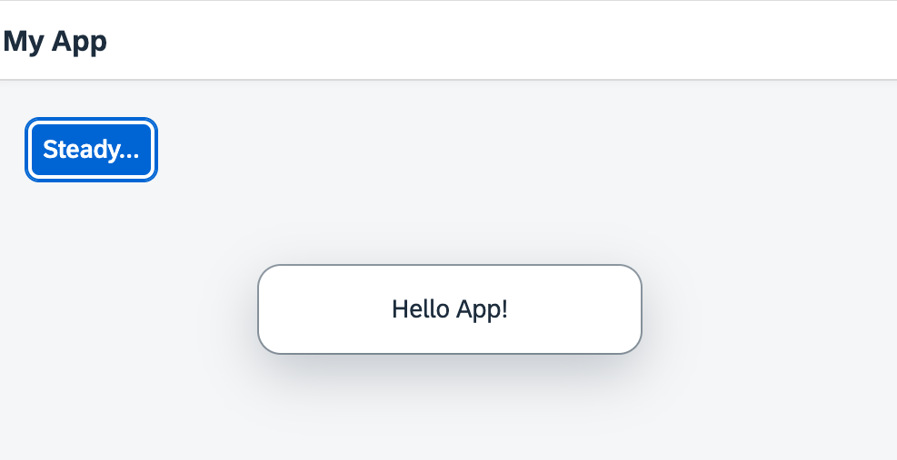

## Step 2: Steady...

Now we extend our minimalist HTML page to a basic app with a view and a controller.

&nbsp;

***

### Preview




<sup>*The browser shows a Steady button in an app*</sup>

You can access the live preview by clicking on this link: [🔗 Live Preview of Step 2](https://ui5.github.io/tutorials/quickstart/build/02/index.html).

***

### Coding

<details class="ts-only">

You can download the solution for this step here: [📥 Download step 2](https://ui5.github.io/tutorials/quickstart-step-02.zip). 

</details>

<details class="js-only">

You can download the solution for this step here: [📥 Download step 2](https://ui5.github.io/tutorials/quickstart-step-02-js.zip).

</details>
***


### webapp/index.?s

Now we replace most of the code in this file: We remove the inline button from the previous step, and introduce a proper XML view to separate the presentation from the controller logic. We prefix the view name `ui5.quickstart.App` with our newly defined namespace. The view is loaded asynchronously.

Similar to the step before, the view is placed in the element with the `content` ID after it has finished loading.

```ts
import XMLView from "sap/ui/core/mvc/XMLView";

XMLView.create({
	viewName: "ui5.quickstart.App"
}).then((oView) => oView.placeAt("content"));
```
```js
sap.ui.define([
	"sap/ui/core/mvc/XMLView"
], (XMLView) => {
	"use strict";

	XMLView.create({
		viewName: "ui5.quickstart.App"
	}).then((oView) => oView.placeAt("content"));
});
```

### webapp/App.view.xml \(New\)

The presentation logic is now defined declaratively in an XML view. UI controls are located in libraries that we define in the `View` tag. In our case, we use the bread-and-butter controls from `sap.m`. The new controls in the view are an `App` and a `Page`. They define a Web app with a header bar and a title.

The button from the previous examples now also defines a `type` and a `class` attribute. This improves the layout of our button and makes it stand out more.

We outsource the controller logic to an app controller. The `.onPress` event now references a function in the controller.

```xml
<mvc:View
	controllerName="ui5.quickstart.App"
	displayBlock="true"
	xmlns="sap.m"
	xmlns:mvc="sap.ui.core.mvc">
	<App>
		<Page title="My App">
			<Button
				text="Steady..."
				press=".onPress"
				type="Emphasized"
				class="sapUiSmallMargin"/>
		</Page>
	</App>
</mvc:View>
```

### webapp/App.controller.js \(New\)

In our controller, we load the `Controller` base class and extend it to define the behavior of our app. We also add the event handler for our button. The `MessageToast` is also loaded as a dependency. When the button is pressed, we now display a "Hello App" message.

```ts
import Controller from "sap/ui/core/mvc/Controller";
import MessageToast from "sap/m/MessageToast";

export default class App extends Controller {
	onPress(): void {
		MessageToast.show("Hello App!");
	}
}
```
```js
sap.ui.define([
	"sap/ui/core/mvc/Controller",
	"sap/m/MessageToast"
], (Controller, MessageToast) => {
	"use strict";

	return Controller.extend("ui5.quickstart.App", {
		onPress() {
			MessageToast.show("Hello App!");
		}
	});

});
```

You can see a title bar and a blue button that reacts to your input. Congratulations, you have created our very first app.


**Next:** [Step 3: Go!](../03/README.md "Before we can do something with UI5, we need to laod and initialize it. This process of loading and initializing UI5 is called bootstrapping. Once this bootstrapping is finished, we simply display an alert.")

***

**Related Information**  

[XML View](https://sdk.openui5.org/#/topic/1409791afe4747319a3b23a1e2fc7064 "The XML view type is defined in an XML file, with a file name ending in .view.xml. The file name and the folder structure together specify the name of the view that equals the OpenUI5 module name.")

[Controller](https://sdk.openui5.org/#/topic/121b8e6337d147af9819129e428f1f75 "A controller contains methods that define how models and views interact.")
